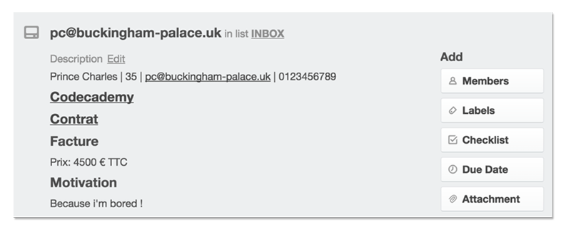

## Set up

- Join us on [Le Wagon's Slack](https://teamwagon.slack.com) and create a channel for your city `#city`.
- Read [our graphical guidelines](https://github.com/lewagon/design/tree/master/guidelines) and download our [brand assets](https://github.com/lewagon/design/tree/master/guidelines/brand) to save time in the next steps.
- Make a pull-request on [Le Wagon website repository](https://github.com/lewagon/www-sinatra) to add your city page (ex: [Paris page](http://www.lewagon.org/paris))
- When it's done, we'll plug our *application tool* to your city page then you can start getting candidates right on!
- Create a meetup group following our [meetup graphical guidelines](https://github.com/lewagon/design/tree/master/guidelines/meetup) (ex: [Le Wagon Paris meetup](http://www.meetup.com/fr/Le-Wagon-Paris-Coding-Station/))
- Create a Twitter account for your city `@lewagon<city_name>` (e.g. `@lewagonlosangeles`)
- For Facebook / Youtube, we all play as a team and use the same page / channel.

## Bootstrapping

- When the setup is done, time to work on the **acquisition**.
- Connect with the tech spots (coworking places, startup accelerators...) that accept to organize free workshops in their place and help you communicate on them. Of course, use your meetup group for these workshops!
- Make at least **1 workshop / week**. Showing your pedagogical skills is the best way to onboard candidates.
- Connect to ruby and devs communities to meet potential teachers if you don't have any developers in the team yet. We'll be more than happy to help you test potential teachers during skype sessions.
- From the beginning, discuss with tech spots about the opportunity to run the first batches of the program in their place.

Now a bit of help for running workshops and pitching Le Wagon's program.

- [Pitch Deck](https://github.com/lewagon/launch-kit/tree/master/pitch)
- [Workshops (keynotes + videos)](https://github.com/lewagon/launch-kit/tree/master/workshops)
- [Print](https://github.com/lewagon/design/tree/master/guidelines/print): need some stickers for your workshops? some flyers, business cards?

## Application process

There is a lot of magic & automation in there :)

Each session has a dedicated Trello board linked to the website application page.

This Trello board is always the same with the same lists.

For each application, a card is created in the INBOX list when the candidate fill up the form to apply and validate it.

_Tip:_ if you're using Chrome please install the [CardCounter extension](https://chrome.google.com/webstore/detail/cardcounter-for-trello/miejdnaildjcmahbhmfngfdoficmkdhi?hl=en), very useful.

Here is the detailed onboarding process:

- **INBOX:** you'll find the recent applications.

  - **_From_ INBOX _to_ FIRST CONTACT:** have a look on the content of the card. If it's a serious candidate, **drag & drop** his card in the FIRST CONTACT list. This will **automatically** send an email to the candidate. He'll be able to book an itw directly on your agenda using [Acuity Scheduling](https://acuityscheduling.com/).

- **FIRST CONTACT:** the candidate stays in this list until he booked an itw.

- **INTERVIEW:** in this list you'll find all your future interviewees.

  - **_From_ INTERVIEW _to_ CODECADEMY:** if you feel that the candidate is a good fit, ask him to complete the Ruby track on Codecademy in 9/10 hours (max!). **Drag & drop** his card in the CODECADEMY list and this will **automatically** send him an email with all the instructions (this email ask for his Codecademy username as our little homemade bot gonna tell us when he's done with the track.).

  - **_From_ INTERVIEW _to_ NO GO:** If the candidate doesn't fit, the card goes to NO GO

  - **_From_ INTERVIEW _to_ LEAD FUTUR:** If the candidate fit and want, but can't (agenda difficulties, family troubles ...) the card goes to LEAD FUTUR

- **CODECADEMY:** the card stay in this list until the candidate has finished the Ruby track. When he does, thanks to the bot, a green label appears on his card. If it's green, it's ready to go! You can **drag & drop** the candidate card from the CODECADEMY to the CONTRACT list and send him the contract. We use [HelloSign](https://www.hellosign.com/) but for the first batch you won't need to implement it.

- **CONTRAT:** the card stays in this list until the contract is signed.

  - **_From_ CONTRACT _to_ ACOMPTE/DEPOSIT:** When the contract is signed, you click on the blue label into the card (signed contract) and you **drag & drop** the card from CONTRACT to ACOMPTE. You can now send your IBAN and ask for the deposit (1/3 in Paris but it depends on the local legislation).

- **ACOMPTE / DEPOSIT:** the card stays in this list until you received the deposit.

  - **_From_ DEPOSIT _to_ GO:** when you receive the payment you can **drag & drop** the card in the GO list.

- **GO:** Well, this is it!!!

- **LEAD FUTUR:** people you should recontact later.

- **NO GO:** people you shouldn't recontact later ...

_Important_: our billing solution is [Zoho Books](https://books.zoho.com). It's great and you should use it, but as for HelloSign we'll implement it to improve the automation after the first batch.

And talking about the 1st batch...

## 1s batch is live !

You have your 20 students for the 1st batch. **Yeahhhhhh!** time for us to add your lead developpers on our pedagogical platforms and brief them all about it.

## Our mindset

Launching Le Wagon is a matter of trust and **shared values**.

### Collaboration

By collaborating with each other to improve pedagogical contents, graphical assets, communication supports, etc.. we can just create something much bigger. Every contribution benefits to all teams and we all become better at what we do.

Of course, you are the project owner, you drive your city, your community, your business opportunities, and you are free to experiment things, but this collaboration mindset should drive the way you work & communicate with the rest of us.

Here is a list of things that don't really fit with collaboration :

- **"Double-brandings"** with expressions such as **Le Wagon by ...** or **... by Le Wagon**. If you launch Le Wagon, it's Le Wagon and adding an extra brand is just weakening your communication and blurring the message.
- **"External landing page"**. Instead, you should make a pull request to our website city page so that every one can benefit from it. That's our spirit !

Here is a thing that really fits with collaboration :

- **"Pull requests"**. Making PRs on the content of our pedagogical platform, or on the graphical assets of our design repo, that's what collaboration is about!

### Energy & pragmatism

We know launching a fullstack program is not an easy task.. But the strategy remains quite simple at the end

- Animate cool & free workshops (not so hard to find tech spots interested!)

The objective is reachable unlike so many startups that struggle finding their product/market fit..

Hence, we'll be 300% ready to help you, give you advice, feedbacks, speak about pedagogy, content etc.. but we don't want to partner with **"this is complicated"-people** !

Launching a market place is complicated. Launching Le Wagon is not. It's exhausting, it requires a lot of energy, enthusiasm & passion. But it's not complicated :) That's a second value that we should all share: **simplicity**.

