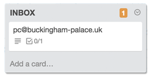
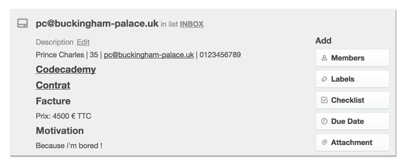

## Vocabulary

**A batch** is one session of the fullstack program which means one city and one period of time. Example: **batch #3 Paris, July-August 2014**.

## Process

A lot of automation here:

- Each batch has a dedicated Trello board linked to the website apply form.
- This Trello board respects a canvas with pre-defined lists.
- Every list has a precise role to play, don't change it.

### First contact

When a candidate applies for a precise batch, a card is created in the **INBOX** list, the first one. You can check the candidates info openning the card, to get his age, phone number, mail, motivation.

_Tip:_ if you're using Chrome please install the [CardCounter extension](https://chrome.google.com/webstore/detail/cardcounter-for-trello/miejdnaildjcmahbhmfngfdoficmkdhi?hl=en), very useful to see how many candidates you have in every list of the application funnel.

Here is the detailed onboarding process.

- **INBOX:** new applications.

  - **_From_ INBOX _to_ FIRST CONTACT:** have a look on the content of the card. If it's a serious candidate, **drag & drop** his card in the FIRST CONTACT list. This will **automatically** send an email to the candidate. He'll be able to book an itw directly on your agenda using [Acuity Scheduling](https://acuityscheduling.com/).

- **FIRST CONTACT:** the candidate stays in this list until he booked an itw.

- **INTERVIEW:** in this list you'll find all your future interviewees.

  - **_From_ INTERVIEW _to_ CODECADEMY:** if you feel that the candidate is a good fit, ask him to complete the Ruby track on Codecademy in 9/10 hours (max!). **Drag & drop** his card in the CODECADEMY list and this will **automatically** send him an email with all the instructions (this email ask for his Codecademy username as our little homemade bot gonna tell us when he's done with the track.).

  - **_From_ INTERVIEW _to_ NO GO:** If the candidate doesn't fit, the card goes to NO GO

  - **_From_ INTERVIEW _to_ LEAD FUTUR:** If the candidate fit and want, but can't (agenda difficulties, family troubles ...) the card goes to LEAD FUTUR

- **CODECADEMY:** the card stay in this list until the candidate has finished the Ruby track. When he does, thanks to the bot, a green label appears on his card. If it's green, it's ready to go! You can **drag & drop** the candidate card from the CODECADEMY to the CONTRACT list and send him the contract. We use [HelloSign](https://www.hellosign.com/) but for the first batch you won't need to implement it.

- **CONTRAT:** the card stays in this list until the contract is signed.

  - **_From_ CONTRACT _to_ ACOMPTE/DEPOSIT:** When the contract is signed, you click on the blue label into the card (signed contract) and you **drag & drop** the card from CONTRACT to ACOMPTE. You can now send your IBAN and ask for the deposit (1/3 in Paris but it depends on the local legislation).

- **ACOMPTE / DEPOSIT:** the card stays in this list until you received the deposit.

  - **_From_ DEPOSIT _to_ GO:** when you receive the payment you can **drag & drop** the card in the GO list.

- **GO:** Well, this is it!!!

- **LEAD FUTUR:** people you should recontact later.

- **NO GO:** people you shouldn't recontact later ...

_Important_: our billing solution is [Zoho Books](https://books.zoho.com). It's great and you should use it, but as for HelloSign well implement it to improve the automation after the first batch.
