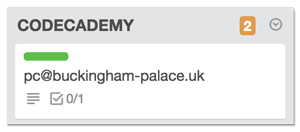

## 1 Batch = 1 Trello board

**A batch** is one session of the fullstack program which means one city and one period of time. Example: **batch #3 Paris, July-August 2014**.

- Each batch has a dedicated Trello board linked to the website apply form.
- This Trello board respects a canvas with pre-defined lists.
- Every list has a precise role to play, don't change it.

## First contact

When a candidate applies for a precise batch, a card is created in the **INBOX** list of the associated board, i.e. the first list. You can open the candidate's card to check his age, motivation, phone number, mail, etc...

_Tip:_ if you're using Chrome please install the [CardCounter extension](https://chrome.google.com/webstore/detail/cardcounter-for-trello/miejdnaildjcmahbhmfngfdoficmkdhi?hl=en), very useful to see how many candidates you have in every list of the application funnel.

## Process

Here is the detailed onboarding process.

- **INBOX:** new applications.

  - **_From_ INBOX _to_ FIRST CONTACT:** have a look on the content of the card. If it's a serious candidate, **drag & drop** his card in the FIRST CONTACT list. This will **automatically** send an email to the candidate. He'll be able to book an interview directly on your agenda using [Acuity Scheduling](https://acuityscheduling.com/).

- **FIRST CONTACT:** the candidate stays in this list until he books an interview. When he does, the card **automatically** moves to the INTERVIEW list (no need to drag & drop it).

- **INTERVIEW:** in this list you'll find all your future interviewees.

  - **_From_ INTERVIEW _to_ CODECADEMY:** after the interview, if you feel that the candidate is a good fit, ask him to complete the Ruby track on Codecademy in 9/10 hours (max!). **Drag & drop** his card in the CODECADEMY list. This will **automatically** send him an email with all the instructions. This email asks for his Codecademy username. Then, our home-made bot can automatically check his score every day and detect when the candidate is done with the ruby track.

  - **_From_ INTERVIEW _to_ NO GO:** If the candidate doesn't fit, the card goes to NO GO.

  - **_From_ INTERVIEW _to_ LEAD FUTUR:** If the candidate fits and wants, but can't (agenda difficulties, family troubles ...) the card goes to LEAD FUTUR.

- **CODECADEMY:** the card stays in this list until the candidate has finished the Ruby track. When he does, thanks to the bot, a green label appears on his card. If it's green, it's ready to go! You can **drag & drop** the candidate card from the CODECADEMY to the CONTRACT list and send him the contract. We use [HelloSign](https://www.hellosign.com/) for eSignatures. For the first batch, it's overkill to plug HelloSign so you'll have to send the contract by mail. We'll help you plug HelloSign from batch #2.

- **CONTRACT:** the card stays in this list until the contract is signed.

  - **_From_ CONTRACT _to_ DEPOSIT:** When the contract is signed, you click on the blue label inside the card (signed contract) and you **drag & drop** the card from CONTRAT to ACOMPTE. You can now send your IBAN and ask for the deposit (1/3 in Paris but it depends on the local legislation).

- **DEPOSIT:** the card stays in this list until you receive the deposit.

  - **_From_ DEPOSIT _to_ GO:** when you receive the payment you can **drag & drop** the card in the GO list.

- **GO:** Well, this is it!!!

- **LEAD FUTUR:** people you should recontact later.

- **NO GO:** people you shouldn't recontact later...

_Important_: our billing solution is [Zoho Books](https://books.zoho.com). It's great and you should use it, but as for HelloSign, we'll implement it to improve the automation after batch #1.

## Running the interview

- **Expectations**: Le Wagon is a hard and challenging program. Students will start by learning the basics of code, OOP and software architecture during the 3 first weeks. Very interesting for sure, but potentially disappointing for people with wrong expectations.. Don't accept students who just want to "build their project but don't care about code", or people who heard  that code is a hot topic and want to "know more about it". You need 300%-involved candidates, who want to learn programming because they know they'll use it in their everyday-life, to find a cool job or build tech products. People with wrong expectations will give up quickly because they'll find the program too hard and not "rewarding enough". People with good motivations will be enthusiastic every day of the program.

- **Smartness & Passion**: Le Wagon is not reserved to Mathematics PhD. However, the program is intense and candidates should be able to grasp new concepts quickly. It's 50% about fighting-spirit & motivation, 50% about brain skills.

- **Sociability**: a lot of Le Wagon's magic comes from team spirit in each batch. For that you need sociable people, asking questions during morning talks when they don't get it, passionated about explaining to others what they've just understood, etc.. Don't neglect that part duing the interview.
